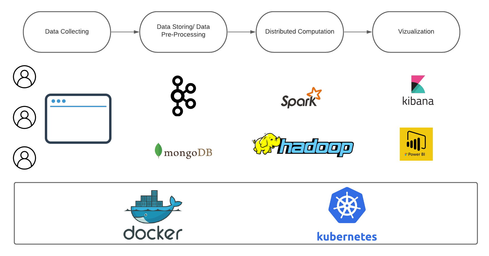

## Welcome to my Github.io: BigData Platform (In progress)
This is the repository for the most interesting project (for me) that I have ever built :grin:

The motivation for this project: I love pets (undoubtedly inspired by the dogs that I raised and loved as my closest friends). So I hope I can create a platform that help connect pet lovers, and enable them to find and adopt pets with a few clicks. And I want to go further: With this platform, people can help protect wild pets by reporting about mistreated pets, or abandoned pets that don't any place to live. 

These functions will be realized based on the data provided by user. My data-driven platform will run Machine Learning algorithms (clustering, recommendation system,....) on distributed platforms like Hadoop or Spark. It will also provide users with statistics and vizualizations about pet situation, pet distribution, or areas with high number of endangered cases

Below is the diagream for my platform (I created by lucidchart.com)

### UI
Currently, I'm working on the interface for the web. I use JavaScript (Express/Nodejs) to handle requests to my server

A brief looking of the web:

*(Still updating...)*
